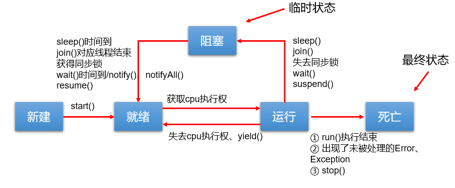
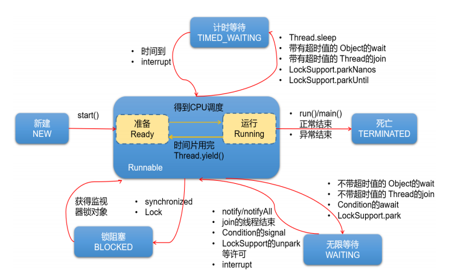

# 1. 概念
- 程序(program): 为完成任务而编写的一组指令的集合(静态对象, 一段的代码)
- 进程(process): 程序的一次执行过程, 或是正在内存中运行的应用程序(动态对象)
  - 有独立内存空间, 存在生命周期
  - OS 调度和分配资源的最小单位
  - 进程间通信成本高
- 线程(thread): 进程中的一段执行路径(一个进程中至少有一个线程)
  - 并行执行, 是 CPU 调度 和 执行的最小单位
  - 共享堆和方法区, 隔离 PC(程序计数器), VMS(虚拟机栈), NMS(本地方法栈), 线程间通信成本低
- 线程调度策略: 分时调度, 抢占式调度
- 多线程优点: 
  - 提高应用程序的响应, 对增强用户图形化界面体验
  - 提高 CPU 的利用率
  - 提供一定的抽象
- 并发与并行的概念
- 多核的成本: 共用资源限制, 调度损耗

# 2. 线程创建
- 方法一: 继承 Thread 类, 覆盖 run 方法(线程执行体)
- 方法二: 实现 Runnable 接口, 实现 runnable 的对象注入到 thread 对象中运行
- 二者区别: 
  - 相同: 都使用 Thread 的 start 方法, 都需要创建 Thread 类或子类的对象
  - 接口优点: 规避单继承问题, 更好处理数据是共享还是分离(Runnable 对象是否共享), 代码和线程分离(Runnable 对象抽象)
  - 两者联系: 本质是代理模式, public class Thread implements Runnable
- 注意: 
  - start 和 run 的区别: start 启动线程, 调用线程执行体, run 则是普通调用
  - 线程 start 后不能再 start 
  - 线程对象优先调用重写线程执行体, 再调用父类代理对象线程执行体
  - run 方法不可以 throw
 
# 3. 线程常用方法
## 3.1 一般方法
- Thread.currentThread() 获取当前线程
- Thread.sleep(ms) 当前线程阻塞指定的毫秒数
- Thread.yield() 建议系统的线程调度器调度一次, 调度器不一定会切换线程
- b.join() 在线程a中通过线程b调用join(), 则线程a进入阻塞状态, 直到线程b执行结束, 线程a才结束阻塞状态, 继续执行
- b.isAlive() 判断线程是否存活
- stop, suspend, resume 不建议使用因为会存在资源未清理, 产生死锁问题 
## 3.2 优先级
- a.getPriority()
- a.setPriority();
- Thread.MAX_PRIORITY, Thread.MIN_PRIORITY (10 / 5 / 1)
- 高优先级意味大概率抢占不是一定
## 3.3生命周期
- 新建, 就绪, 运行, 阻塞, 死亡(1.5 之前)
- 新建, Runnable, 死亡, 计时等待, 无限等待, 阻塞锁(1.5 之后)

# 4. 线程安全
## 4.1 错误问题
- 超量同时进入安全状态, 导致错误
- 更新不及时, 导致重复
## 4.2 同步监视器(锁)
- 原理: Java对象在堆中的数据分为分为对象头, 实例变量, 空白的填充, 而对象头中包含：
  - Mark Word(对象有关的GC, 锁标记等信息), 指向类的指针, 数组长度
  - 线程获得了同步锁对象后, 锁就会记录线程的ID, 线程释放后其他线程才可以占用锁对象
## 4.3 同步代码块 
- 锁对象: 唯一且共享 
  - Runnable: 自定义唯一对象 obj / Runnable::this 
  - Thread: 自定义唯一静态对象 static obj / MyClass\.class
## 4.4 同步方法
- private synchronized boolean sell(): 
  - Runnable: 用普通方法, 默认锁为 obj
  - Thread: 方式下用static方法, 默认锁为 Clazz.class
## 4.5 注意
- 代码块中实际是串行执行, 性能低
- 主线程中调用分线程的 sleep, 则是主线程会 sleep, 可以理解为主线程通过对象调用 sleep
- 抽象设计: 一般将竞争资源和对资源的操作抽象为一个类

# 5. 死锁
## 5.1 单例中的锁
- 饿汉式会产生线程不安全问题
- double-check + volatile(防止指令重排)
- static-func-get 

## 5.2 死锁问题
- 产生: 都在占用对方需要的同步资源不放弃, 都在等待对方放弃自己需要的同步资源
- 原因: 互斥锁存在, 占用且等待, 不可抢夺, 循环等待
- 防止: 一次申请所有锁, 申请不到就释放, 线性顺序申请资源

## 5.3 ReentrantLock
- lock 实例必须唯一
- lock.lock()
- lock.unlock() 需要 try-finally 调用
- 与 synchronized 区别:
  1. Lock 是显式锁（手动开启和关闭锁，别忘记关闭锁），synchronized 是隐式锁，出了作用域、遇到异常等自动解锁
  2. Lock 只有代码块锁，synchronized 有代码块锁和方法锁
  3. 使用 Lock 锁，JVM 将花费较少的时间来调度线程，性能更好。并且具有更好的扩展性 （提供更多的子类），更体现面向对象。
  4. Lock 锁可以对读不加锁，对写加锁，synchronized 不可以
  5. Lock 锁可以有多种获取锁的方式，可以从 sleep 的线程中抢到锁， synchronized 不可以

# 6. 线程间通信
## 6.1 常用方法
- monitor.wait: 将当前线程变成等待状态, 释放同步监视器
- monitor.notify: 唤醒一个优先级较高的等待线程(限于争夺 monitor), 会从 wait 地方执行
- monitor.notifyAll: 唤醒所有等待线程(限于争夺 monitor)
- 注意:
  - 三个方法的调用者需要与同步监视器一致, 必须于同步代码块, 同步方法内调用
  - Object 类中有三个方法定义
- wait 和 sleep 区别:
  - 函数声明位置不同
  - 使用地方限制不同
  - 是否释放同步监视器不同
  - 结束阻塞方式不同
## 6.2 生产者和消费者问题
  - 竞争资源类如何设计
  - 生产者和消费者如何设计

# 7. 其他创建方式
## 7.1 Callable
- Callable 特点: call 为泛型方法, 有返回值, 方法标签可以抛出异常
- 使用 Callable: 通过 FutureTask 和 Thread 类使用, 主线程通过 futureTask.get() 获取分线程结果则存在阻塞
## 7.2 Executors
- Executors 创建线程池
- threadPoolExecutor 强转并通过 execute, submit 执行 runnable