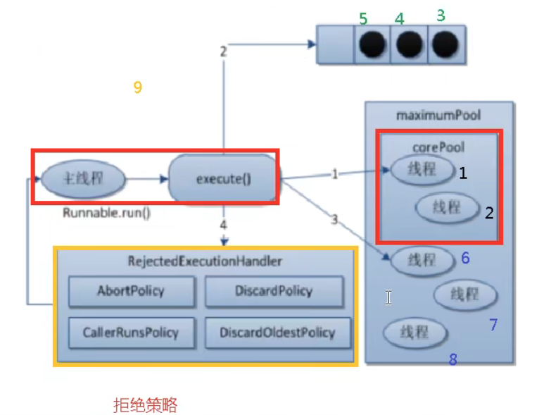

# 1. 基本概念
## Thread 状态
- NEW
- RUNNABLE
- BLOCKED
- TIMED_WAITING
- WAITING
- TERMINATED

## wait/sleep 区别
- sleep: Thread 静态方法, 不需要锁
- wait: Object 对象方法, synchronized 区块中调用, 需要锁

## 管程
- monitor: 监视器即锁, 保证同一时间只有一个线程占用竞争资源, 防止死锁或出现脏读等问题

## 用户线程
- 用户线程: 平时用到的普通线程,自定义线程
- 守护线程: 运行在后台,是一种特殊的线程,比如垃圾回收
- 当主线程结束后,用户线程还在运行, JVM 仍然存活
- 如果没有用户线程, 都是守护线程, JVM 会结束 (没有守护的了)
- Thread.isDaemon() 判断是否是守护线程
- Thread.setDaemon() 设置为守护线程

## lock/synchronized 区别
- lock 是接口, synchronized 是关键字
- lock 需要在 finally 手动释放, synchronized 出区域自动释放
- lock 可让等待锁的线程响应中断, synchronized 不行
- lock 可查询锁是否有被申请到, synchronized 不行

# 2. 线程间通信
## 虚假唤醒问题
- 一般的通信步骤: 
```java
class Foo {
    public synchronized void foo() {
        // 1. 判断(不符合则等待)
        while (!condition) {  // while 包裹判断, 防止虚假换新产生错误 
            wait();
        }
        // 2. 操作
        // do something
        // 3. 通知其他线程
        notifyAll();
    }
}
```
- lock 使用需要通过 Condition.await / Condition.signalAll 进行等待与唤醒

## 定制化通信 
- 通过标志位通信不同的线程
- condition + flag 

# 3. 并发安全集合
- 出现并发问题: ConcurrentModificationException
- Collections.synchronizedList
- Vector (锁)
- CopyOnWriteArrayList (写时复制, 读没加锁)
- CopyOnWriteArraySet<>();
- new ConcurrentHashMap<>();

# 4. 锁相关
- 类型锁和对象锁不是同一把锁
- 公平锁/非公平锁 new ReentrantLock(true/false);
  - 非公平锁: 产生线程饿死, 效率高
  - 公平锁: 加锁时会询问是否有线程在排队, 效率较低
- 可重入锁, 递归锁(ReentrantLock / synchronized): 外层获取则内层不用再获取, 但是必须要释放  
- 查看是否存在死锁: jps -l, jstack id

# 5. Callable 与 辅助类
- Runnable 接口有一个实现类为 FutureTask<T>, 可以接受 Callable 对象进行构造
- CountDownLatch: 检测线程对状态的影响
- CyclicBarrier: 条件完成触发线程执行
- Semaphore: 资源竞争

# 6. 读写锁
## 6.1 基本概念
- 悲观锁: 先取锁来阻塞其他线程, 确保自己独占资源, 效率低, 应用于并发程度高, 一致性要求高情景(Synchronized/ReentrantLock)
- 乐观锁: 版本号或时间戳机制, 提交会核对版本号并解决冲突, 应用于并发程度低, 性能要求高情景(Atomic/CAS)
- 表锁: 锁整张表, 行锁: 锁某一行, 会容易出现死锁
- 读锁: 共享锁 写锁: 独占锁 都会发生死锁
## 6.2 读写锁
- ReadWriteLock lock = new ReentrantReadWriteLock();
- 特点: 读读共享, 读写互斥
- 缺点: 锁饥饿, 一直读不写
- 锁降级: 写锁降级, 读操作通常比写操作更频繁, 可以提供更好的性能和并发性, 
- 锁升级: 读不能升为写, 会存在一致性问题

# 7. 阻塞队列
## 7.1 分类
- ArrayBlockingQueue: 基于数组实现的有界阻塞队列
- LinkedBlockingDeque: 基于链表实现的可选有界/无界阻塞队列
- PriorityBlockingQueue: 基于优先级堆实现的无界阻塞队列
- DelayQueue: 基于优先级堆实现的延迟阻塞队列
- LinkedTransferQueue: 基于链表的传输队列, 可以支持直接传输元素
- SynchronousQueue: 一个不存储元素的阻塞队列, 每个插入操作必须等待一个对应的移除操作

## 7.2 方法 
- 异常: add-remove
- 返回值: offer-poll
- 阻塞: put-take
- 返回值-阻塞: offer-poll-time

# 8. 线程池
## 8.1 基本概念
- 作用: 分配线程, 调度任务
- 优势: 降低成本, 提高响应, 增加管理功能
- 分类: 
  - ExecutorService pool = Executors.newFixedThreadPool(3); 固定线程个数
  - ExecutorService pool = Executors.newSingleThreadExecutor(); 一个线程
  - ExecutorService pool = Executors.newCachedThreadPool(); 可动态扩容

## 8.2 构造参数
```java
class Example {
  /**
   * @param corePoolSize the number of threads to keep in the pool, even
   *        if they are idle, unless {@code allowCoreThreadTimeOut} is set
   * @param maximumPoolSize the maximum number of threads to allow in the
   *        pool
   * @param keepAliveTime when the number of threads is greater than
   *        the core, this is the maximum time that excess idle threads
   *        will wait for new tasks before terminating.
   * @param unit the time unit for the {@code keepAliveTime} argument
   * @param workQueue the queue to use for holding tasks before they are
   *        executed.  This queue will hold only the {@code Runnable}
   *        tasks submitted by the {@code execute} method.
   * @param threadFactory the factory to use when the executor
   *        creates a new thread
   * @param handler the handler to use when execution is blocked
   *        because the thread bounds and queue capacities are reached
   */
  public ThreadPoolExecutor(int corePoolSize,
                            int maximumPoolSize,
                            long keepAliveTime,
                            TimeUnit unit,
                            BlockingQueue<Runnable> workQueue,
                            ThreadFactory threadFactory,
                            RejectedExecutionHandler handler) {
  }
}
```

## 8.3 执行
- 过程
  - 执行 execute 时才创建核心线程
  - 首先分配核心线程
  - 再放入阻塞队列, 等待
  - 再新建非核心线程分配
  - 执行拒绝策略
- 拒绝策略 
  - ThreadPoolExecutor.AbortPolicy: 默认, 抛异常
  - ThreadPoolExecutor.CallerRunsPolicy: 交由提交任务的线程自己执行, 从而避免任务丢失
  - ThreadPoolExecutor.DiscardOldestPolicy: 抛弃阻塞队列中等待最久的
  - ThreadPoolExecutor.DiscardPolicy: 不做任何处理
- 使用
```java
class Foo{
  public void test() throws InterruptedException {
    final int num = 5;
    ThreadPoolExecutor executor = new ThreadPoolExecutor(2, 4, 0, TimeUnit.SECONDS, new ArrayBlockingQueue<>(1), 
                                                         Executors.defaultThreadFactory(),
                                                         new ThreadPoolExecutor.AbortPolicy());
    CountDownLatch latch = new CountDownLatch(num);

    for (int i = 0; i < num; ++i) {
      executor.execute(() -> {
        try {
          Thread.sleep(4000);
        } catch (InterruptedException e) {
          throw new RuntimeException(e);
        }
        System.out.println(Thread.currentThread().getName());
        latch.countDown();
      });
    }
    latch.await();
    executor.shutdown();
  }
}
```



# 9. 分支合并与异步
- 分支合并步骤:
  - 继承 RecursiveTask<Integer>
  - 通过 XXXTask task = new XXXTask()
  - task.fork(), task.join() 获取结果并汇集
- CompletableFuture:
  - CompletableFuture.runAsync() 无返回值线程
  - CompletableFuture.supplyAsync() 有返回值线程
  - integerFuture.whenComplete((result, ex) -> {}) 设定回调