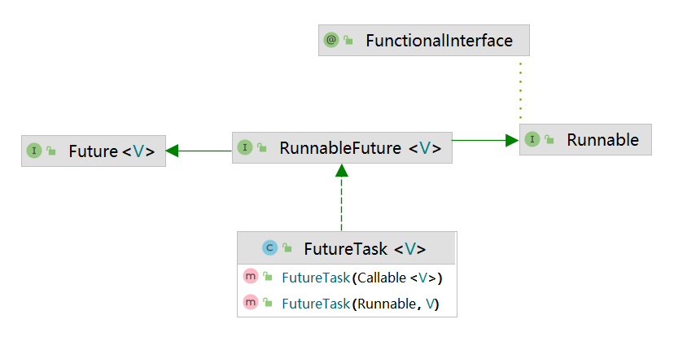

# CompletableFuture
## Future
- Future 接口定义了操作异步任务执行一些方法，如获取结果、取消执行、判断是否被取消、判断是否完毕等, 表示对异步处理的操作
- FutureTask 与 Future 的关系: 
  - `public class FutureTask<V> implements RunnableFuture<V>` 
  - `public FutureTask(Callable<V> callable)` 返回值特性
  - `public interface RunnableFuture<V> extends Runnable, Future<V>` 线程特性 + 异步特性
 

- 一般用线程池 + Future 节省线程创建与销毁资源
- 缺点(获取结果的方法不是最优的): 
  - get() 容易出现阻塞问题, 一般放在最后 或者使用 get(3, TimeUnit.SECONDS) 过时不候, 抛出异常
  - isDone() 轮询耗费 CPU 时间
  - 有用接口较少
- 需要改进的地方:
  - 回调通知
  - 线程池 + 异步
  - 组合
  - 最快结果筛选

## CompletableFuture
- 观察者模式, 任务完成后通知监听一方
- 

