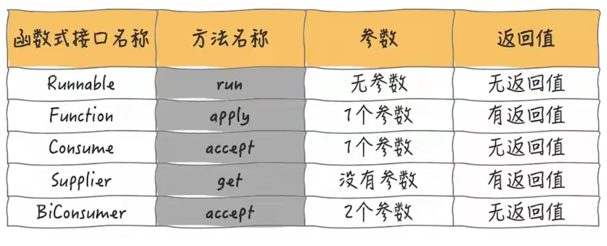

# CompletableFuture
## Future
- Future 接口定义了操作异步任务执行一些方法，如获取结果、取消执行、判断是否被取消、判断是否完毕等, 表示对异步处理的操作
- FutureTask 与 Future 的关系: 
  - `public class FutureTask<V> implements RunnableFuture<V>` 
  - `public FutureTask(Callable<V> callable)` 返回值特性
  - `public interface RunnableFuture<V> extends Runnable, Future<V>` 线程特性 + 异步特性
 


- 一般用线程池 + Future 节省线程创建与销毁资源
- 缺点(获取结果的方法不是最优的): 
  - get() 容易出现阻塞问题, 一般放在最后 或者使用 get(3, TimeUnit.SECONDS) 过时不候, 抛出异常
  - isDone() 轮询耗费 CPU 时间
  - 有用接口较少
- 需要改进的地方:
  - 回调通知
  - 结合线程池
  - 任务阶段组合
  - 最快结果筛选

## CompletableFuture
### 基础原理
- 设计原理: 观察者模式, 任务完成后通知监听一方
- 类架构: 
  - `public class CompletableFuture<T> implements Future<T>, CompletionStage<T>` 
  - CompletionStage: 代表异步任务中的一个步骤, 类似 Linux 操作系统中的管道符  
- 创建方法:  
  - `public static CompletableFuture<Void> runAsync(Runnable runnable, Executor executor)`
  - `public static <U> CompletableFuture<U> supplyAsync(Supplier<U> supplier, Executor executor)` 
- 组合方法:
  - `public CompletableFuture<T> whenComplete(BiConsumer<? super T, ? super Throwable> action)`
  - `public CompletableFuture<T> exceptionally(Function<Throwable, ? extends T> fn)`
 
### 流式调用
- 函数式接口:



- join 和 get 区别:
  - join 不抛异常, get 抛异常
  - join 不可中断, get 可中断

- 使用案例
```java
class Foo {
    static public List<String> calcProductsAsync(List<Mall> malls, String productName) {
        return malls
                .stream()
                .map((mall) -> CompletableFuture.supplyAsync(
                        () -> String.format("%s in %s price: %f", productName, mall.getName(), mall.calc(productName))))
                .toList()
                .stream()
                .map(CompletableFuture::join)
                .collect(Collectors.toList());
    }
}
```

### 步骤接口分类
- 获取结果:
  - `public T get() throws InterruptedException, ExecutionException`
  - `public T get(long timeout, TimeUnit unit) throws InterruptedException, ExecutionException, TimeoutException`
  - `public T join()`
  - `public T getNow(T valueIfAbsent)`
- 结果处理: 
  - `public <U> CompletableFuture<U> thenApply( Function<? super T,? extends U> fn)`
  - 
    
